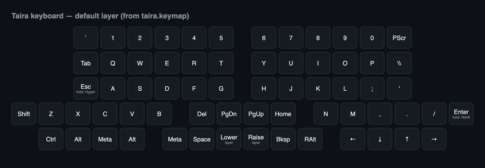
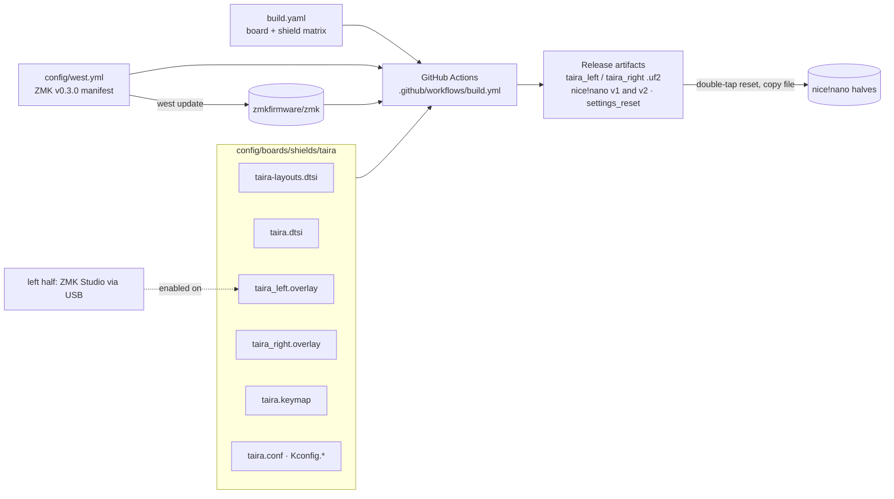

# Taira Keyboard ZMK config

This repository builds the latest ZMK firmware for the [Taira Keyboard](https://github.com/strayer/taira-keyboard).

1. download the firmware assets from the latest [Release](https://github.com/strayer/taira-keyboard-zmk-config/releases/latest)
   - for nice!nano v1.0: `taira_left-nice_nano-zmk.uf2` and `taira_right-nice_nano-zmk.uf2` 
   - for nice!nano v2.0: `taira_left-nice_nano_v2-zmk.uf2` and `taira_right-nice_nano_v2-zmk.uf2` 
2. attach one Taira side to a computer by USB-C
3. put the Taira into flash mode by double-pressing the reset button
4. copy the relevant .uf2 file to the attach USB storage device to flash the nice!nano
5. repeat for the other side
6. fork this repository to customize the keymap.

## Default layer

Key layout of the default layer, generated from `config/boards/shields/taira/taira.keymap`.

## Architecture

More detail: [docs/ARCHITECTURE.md](docs/ARCHITECTURE.md)
