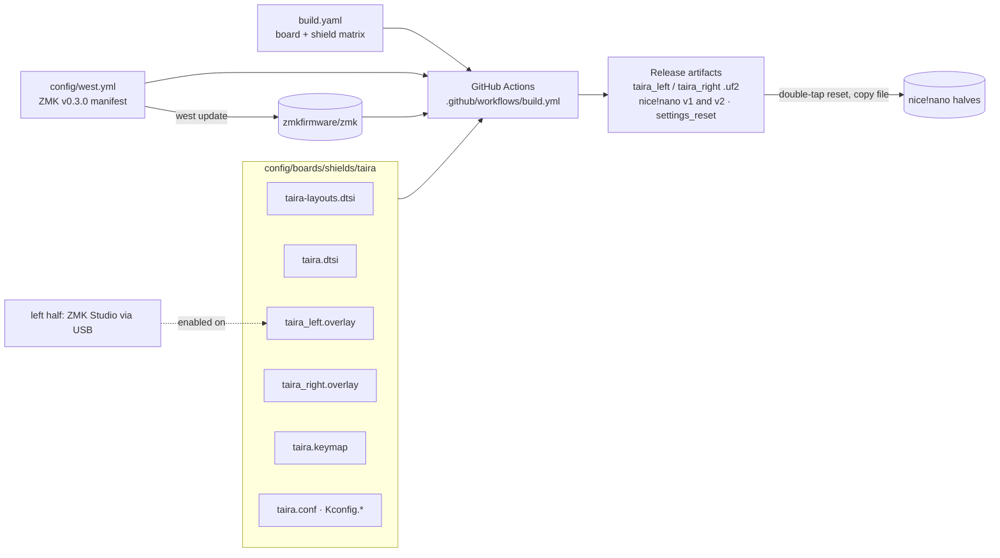

# Architecture

A ZMK firmware config: this repo holds only the board-specific files. GitHub Actions pulls ZMK via `west`, combines it with the config, and publishes flashable `.uf2` files.

```mermaid
flowchart LR
    West["config/west.yml<br/>ZMK v0.3.0 manifest"] -->|west update| ZMK[(zmkfirmware/zmk)]
    Matrix["build.yaml<br/>board + shield matrix"] --> CI

    subgraph Shield["config/boards/shields/taira"]
        Layout[taira-layouts.dtsi]
        DT[taira.dtsi]
        L[taira_left.overlay]
        R[taira_right.overlay]
        Key[taira.keymap]
        Conf["taira.conf · Kconfig.*"]
    end

    CI["GitHub Actions<br/>.github/workflows/build.yml"]
    West --> CI
    Shield --> CI
    ZMK --> CI
    CI --> Art["Release artifacts<br/>taira_left / taira_right .uf2<br/>nice!nano v1 and v2 · settings_reset"]
    Art -->|double-tap reset, copy file| Board[(nice!nano halves)]
    Left[left half: ZMK Studio via USB] -.enabled on.-> L
```
